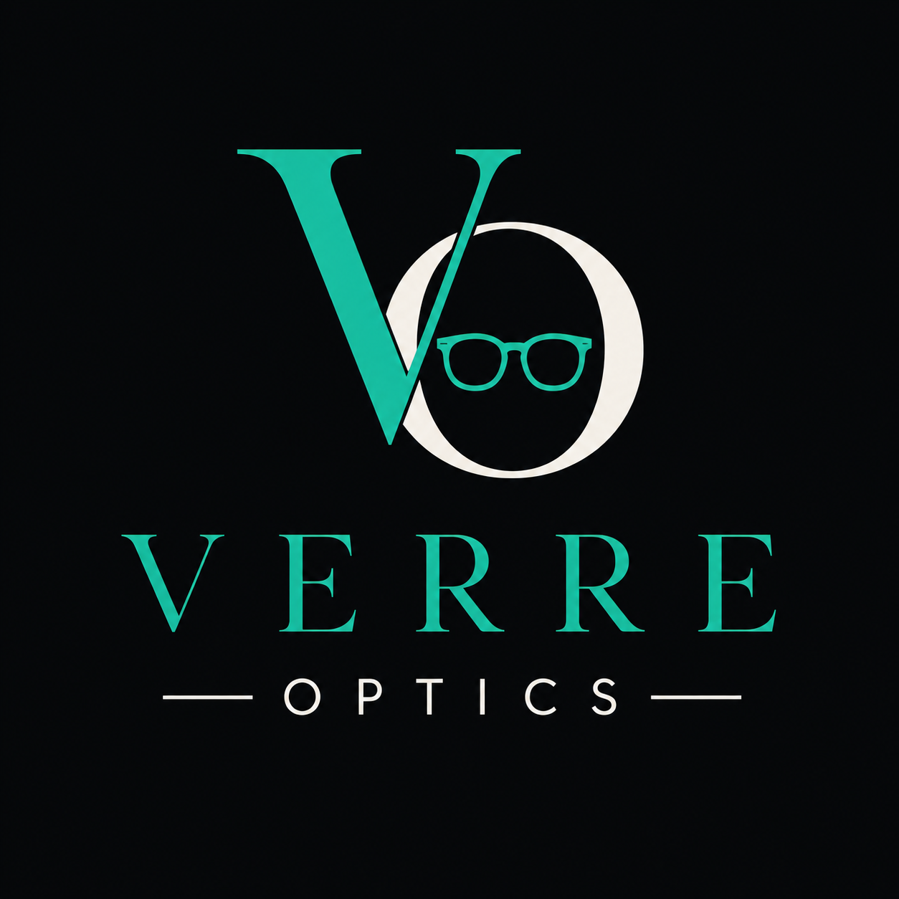

<p align="center">
  
</p>

<h1 align="center">Verre Optics</h1>

<p align="center">
  <em>Find the frames made for your face.</em><br/>
  Private, in-browser eyewear styling — no account, no uploads, no API keys.
</p>

<p align="center">
  
  
  
  
  
</p>

---

An editorial, in-browser eyewear recommender. Upload a photo — or use your camera — and
Verre Optics reads your face shape, features and skin tone, then recommends frame shapes, colors
and sizes. Emerald & Ink design system with full light/dark mode.

**Everything runs client-side.** Your photo never leaves the browser. No API keys, no account,
no server.

## Features
- **Upload or Camera** — pick a photo or capture live via webcam (with an on-screen framing guide)
- **Full analysis** — face shape (with probabilities), symmetry, per-feature ratings, DBL & sizing
- **Frame recommendations** — shapes, colors and sizing tuned to your face + printable report
- **Face-shape guide** — learn the six shapes and which frames flatter each
- **Light / dark mode** — theme toggle, OS-preference aware, persisted
- **Motion** — animated hero carousel, scroll-drawn step timeline, reveal animations (reduced-motion aware)

## Stack
- **Vite + React + Tailwind CSS** — hostable static site, CSS-variable theme tokens
- **@vladmandic/face-api** — 68-landmark face detection (models in `public/models`)
- **GSAP + ScrollTrigger** — scroll animations (respects `prefers-reduced-motion`)
- **react-router-dom** — `/` marketing landing, `/try` the analysis app

## How the analysis works
The original app called the Anthropic Vision API (only works inside a claude.ai artifact).
This version reproduces the same result shape **entirely from geometry**:

- `src/lib/faceAnalysis.js` — face shape (prototype scoring → probabilities), DBL & face
  width (scaled from average interpupillary distance), per-feature measurements, symmetry,
  and geometry-derived 0–10 ratings.
- `src/lib/skinTone.js` — samples well-lit skin patches, converts to CIE-Lab and classifies
  by **ITA** (Individual Typology Angle) into fair → dark, with an olive-undertone check.
- `src/lib/recommend.js` — face-shape → frame-shape and skin-tone → color mappings.

> Ratings are deterministic geometry heuristics (proportion + symmetry), not AI aesthetic
> judgments — the UI labels them as such.

## Develop
```bash
npm install
npm run dev        # http://localhost:5173
```

## Build & deploy
```bash
npm run build      # -> dist/
npm run preview    # preview the production build
```
Deploy `dist/` to any static host (Vercel, Netlify, GitHub Pages). Because the app uses
client-side routing, configure a **SPA fallback** so unknown routes serve `index.html`
(Vercel/Netlify do this automatically). If hosting under a subpath, set `base` in
`vite.config.js`.

## Notes
- Best results come from a clear, front-facing photo with even lighting. Angled or heavily
  side-lit photos reduce accuracy (symmetry and skin tone especially).
- `framefit.jsx` in the repo root is the original single-file artifact, kept for reference.
